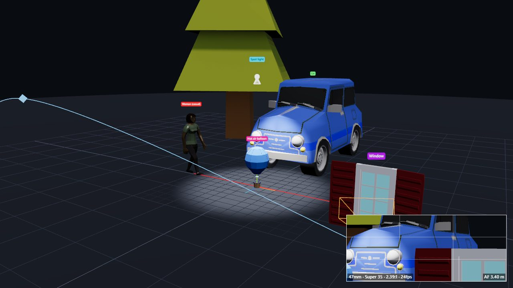

# PrevizXR

**Open-source VR previsualization for AI video.** Block out a scene in VR with actors, props and a handheld virtual camera, record camera takes, then export frame-synced video passes (clay, ID color, depth, normals, OpenPose skeletons) to drive generative video models with video-to-video, depth or pose control.

Runs entirely in the browser: Meta Quest 3 for capture, and desktop Chrome/Edge for scene building and rendering. No install, no server, no account.

**Live:** https://sirjoeyama.github.io/PrevizXR/



> **Status:** all seven milestones are done: scene building in VR and on desktop, a 2,000+ model library, a virtual camera with real lens controls, take recording and playback, five frame-synced render passes plus camera export in one bundle, hand tracking, and Quest performance tuning. Feedback and pull requests are welcome. See the [roadmap](#roadmap).

## Features

- **Scene building** *(available now)*: four rigged humanoid actors with idle, walk, run and sit clips and waypoint paths you draw on the floor; blockout shapes (box, cylinder, wall, door frame, chair, table, car); 42 bundled furniture, street, vehicle, nature and building models; point and spot lights. Every object gets a flat ID color and a name label. Grab, move, rotate, scale, snap to floor, duplicate, delete, undo and redo, in VR and on desktop. Any object can follow a waypoint path (props and lights keep their height and orientation and turn with the path). Paths are smooth Bézier curves: drag waypoints and their curve handles to reshape them, and **Smooth curve** resets the handles. Preview plays everything from the start: paths, clips and the keyframed camera path (the camera monitor shows the shot).
- **Model library** *(available now)*: search and place any of the 2,292 [Poly by Google](https://poly.pizza/u/Poly%20by%20Google) models (CC-BY 3.0) or the 1,411 [Quaternius](https://poly.pizza/u/Quaternius) models (mostly CC0) on Poly Pizza, loaded on demand. Quaternius's 234 animated characters and animals come in as actors with all their clips. Attribution is tracked per scene in the Credits panel. See [ASSETS.md](ASSETS.md).
- **Mesh2Motion characters and motions** *(available now)*: 28 rigged human characters sharing one skeleton, so all 165 human clips (idle, walks, runs, sitting, dancing, fighting, deaths, climbing, mocap gestures…) play on any of them; 14 animals (fox, dog, horse, birds, shark, whale, dragon, T-Rex, spider, snake…) with their own clips; and 44 props (weapons, tools, shields). Mostly CC0, loaded on demand from the [Mesh2Motion](https://github.com/Mesh2Motion/mesh2motion-app) library. See [ASSETS.md](ASSETS.md).
- **Reference images** *(available now)*: import JPG, PNG or WebP storyboards, concept art or plates, and place them as floating picture planes you can grab, move, rotate and scale in VR. They are hidden from the camera monitor and renders by default (toggle **Hide in renders** in the inspector to use one as a backdrop). Images live in the browser's image library and are embedded in exported scene files.
- **Scenes** *(available now)*: autosaved in the browser (IndexedDB), reopened on the next visit, and importable/exportable as `.previz.json` files.
- **Virtual camera** *(available now)*: a camera you hold in VR (it follows your right controller) or fly on desktop, with a live monitor on the camera body and a picture-in-picture monitor on desktop. Focal length from 14 to 135 mm (presets or continuous) gives the correct field of view for a Super 35 (24.89 × 18.66 mm) or full-frame (36 × 24 mm) sensor at 16:9, 9:16, 2.39:1 or 1:1. Also: 24/25/30 fps, autofocus on the frame centre or manual focus distance, and rule-of-thirds, safe-area and centre guides.

- **Takes** *(available now)*: record a camera move with a 3-2-1 countdown, in VR (hold the camera and pull the trigger) or on desktop (fly the camera in camera view). Actors play their paths from the start while you record. Takes are captured at exactly the lens frame rate (24/25/30 fps), whatever the headset refresh rate, and stored per frame: camera position, rotation, focal length and focus distance, plus every object's transform and each actor's clip and clip time. Play takes back in the headset or on desktop. Smoothing (0–100%) is applied on playback without touching the raw take. Takes are saved in the browser and import/export as `.take.json`.
- **Camera paths** *(available now)*: build a keyframed dolly/crane move (smooth spline through keys, with rotation and focal length interpolated), preview it, and save it as a take. The path is a Bézier curve through the keys with editable handles. On desktop, add keys from the camera, then select the camera and drag a key or handle (or click it for the gizmo); in VR, draw the path with the camera in your hand, then grab the numbered markers and handles to reshape it and retime keys in the menu.

- **Render passes** *(available now)*: **clay**, **color_id**, **depth**, **normals** and **pose** (OpenPose COCO-18), rendered offline frame by frame from a take, all at the same resolution (480p/720p/1080p on the short side) and frame rate. Each pass is encoded to **H.264 MP4** with WebCodecs and [Mediabunny](https://mediabunny.dev), or to a **lossless PNG sequence** (zip) when you need exact ID colors and depth values, or when the browser can't encode H.264. Rendering is deterministic: the same take renders byte-identical frames every time. Shows progress, can be canceled, and keeps running at full speed in a background tab.

- **Export bundle** *(available now)*: one zip per render with every pass, `camera.json` (per-frame position, rotation, focal length, focus, field of view and pinhole intrinsics), `camera.glb` (animated camera for Blender, Unreal or After Effects), the take and scene files, `manifest.json` (describes every file and how each pass is encoded) and `CREDITS.txt`.

## Setup

Requires Node.js 22 or newer.

```bash
git clone https://github.com/SirJoeYama/PrevizXR.git
cd PrevizXR
npm install
npm run dev
```

Open http://localhost:5173.

| Command | What it does |
| --- | --- |
| `npm run dev` | Dev server with hot reload (also reachable on your LAN) |
| `npm run check` | Lint, typecheck and unit tests |
| `npm run build` | Production build into `dist/` |
| `npm run preview` | Serve the production build |

### Testing in VR

- **Quest 3:** WebXR needs HTTPS or localhost. With the headset connected over USB and developer mode on, run `adb reverse tcp:5173 tcp:5173`, then open `http://localhost:5173` in the Quest browser. Or open the live Pages URL.
- **No headset:** install the [Immersive Web Emulator](https://chromewebstore.google.com/detail/immersive-web-emulator/cgffilbpcibhmcfbgggfhfolhkfbhmik) extension for Chrome/Edge, open DevTools → WebXR, choose a Meta Quest 3 device, and reload. **Enter VR** becomes available.

## Controls

### Desktop

| Input | Action |
| --- | --- |
| Left drag | Orbit |
| Right drag | Pan |
| Mouse wheel | Zoom |
| `W` `A` `S` `D` / arrow keys | Move (click the viewport first) |
| `Q` / `E` | Down / up |
| `Shift` | Move faster |
| Click | Select an object (click empty floor to deselect) |
| `1` / `2` / `3` | Move / rotate / scale gizmo |
| `G` | Snap the selection to the floor |
| `F` | Focus the view on the selection |
| `P` | Draw a path for the selected object: click the floor to add waypoints, `Esc` to finish |
| Drag a waypoint or handle | Move it across the ground (`Shift`: up and down). Works on the selected object's path, or the camera path when the camera is selected. Clicking one also puts the gizmo on it for precise moves; `Esc` to finish |
| `Ctrl+D` / `Delete` | Duplicate / delete |
| `Ctrl+Z` / `Ctrl+Y` (or `Ctrl+Shift+Z`) | Undo / redo |
| `Space` | Preview from the start (paths, clips and the camera path), or stop |
| `C` | Select the camera |
| `V` | Look through the camera (letterboxed); drag to aim, `W` `A` `S` `D` / `Q` `E` to move, wheel to zoom, `V` or `Esc` to exit |
| `M` | Show or hide the camera monitor in the viewport corner |
| `R` | Record a take (3-second countdown), or stop recording |
| `K` | Add a camera path keyframe at the camera's current position |
| `Space` | While a take plays or records: stop |

To render, select a take in the **Takes** panel and click **Render…**. Choose resolution, format and passes, set the depth range (or use **Auto**, which fits near/far to everything the camera sees during the take), then download the files.

The desktop layout:

- **Top bar:** scene name (click to rename) with its save status and ⋯ menu (new, open, import, export), undo/redo, **Preview**, **Record**, **Render**, help (`?`), VR settings and **Enter VR**. The buttons at each end show or hide the side panels.
- **Left (Add):** actors, animals and props (including the Mesh2Motion library), blockout shapes, models, lights, the Poly library and your images. Click one to place it on the floor at the centre of the view, facing you.
- **Right (properties):** **Object** has a list of everything in the scene plus the selected object's settings, **Camera** has position, lens and the keyframed path, and **Takes** has recordings and Render. Selecting the camera or an object switches tabs for you.
- **Viewport toolbar:** move / rotate / scale, snap to floor, focus, look through the camera, and the camera monitor. A status line shows object count, FPS and credits.

**Reference images:** in **Add → Images**, click **Import images…**, drop image files on the 3D view, or paste an image (`Ctrl+V`). Each image becomes a 1 m tall picture plane floating in front of the view; scale it with the gizmo or the inspector. Large photos are downscaled to 2048 px so they stay light on the Quest.

### VR (Quest controllers)

| Input | Action |
| --- | --- |
| **B** | Show or hide the menu on your left controller |
| Trigger (pointing at the menu) | Press a button or add the highlighted object in front of you |
| Trigger (pointing at an object, the camera or a camera-path marker) | Select it; hold the trigger and move to drag it |
| Trigger (path drawing on) | Add a waypoint where the ray hits the floor |
| Grip | Grab the object under the ray; it stays upright and turns with your wrist |
| Grip + trigger | Grab with free rotation |
| Grip on both controllers | Scale the grabbed object |
| Thumbstick while grabbing | Push/pull along the ray (up/down), turn it (left/right) |
| Left thumbstick | Walk |
| Right thumbstick | Snap turn 30° |
| **A** | Snap the selection to the floor |
| **X** / **Y** | Undo / redo |
| Right thumbstick click | Hold the camera in your right hand (it points where the controller points), or let go |
| Right thumbstick up/down while holding | Zoom (focal length) |
| Trigger while holding the camera | Record a take (3-2-1 countdown), or stop; while drawing a camera path, drop a keyframe |

The menu opens above your left controller when you enter VR; **Exit VR** at its top right leaves the headset session. Its **Scene** tab has the scene files (**New**, **Save**, **Open** a saved scene, **Export** to Downloads, and **Import**, which leaves VR to show the file picker) and lists the camera and every object: pick one to select it, then **Go to** takes you next to it. Under the selection, **Draw path** adds waypoints for any object (actors walk them; props and lights glide at their height), with **Clear**, **Smooth**, **Loop** and speed. Paths are Bézier curves: with the object selected, grab a waypoint or one of its curve handles (the small dots; grey until edited) to reshape the curve. Moving one handle mirrors the other so the curve stays smooth through the waypoint.

The **Cam path** tab builds a keyframed camera move. **Draw path** puts the camera in your hand: frame the shot on its monitor and pull the trigger to drop a key (the stick zooms, and each key keeps its focal length). Keys appear as numbered markers along the path: point at one with either hand and hold the trigger (or grip) to move and turn it. With the camera selected, each key also shows its curve handles to bend the path between keys (**Smooth** resets them). The list retimes keys (±0.5 s), moves the camera to a key (**Go**), replaces a key with the current camera (**Set**) or deletes it, and **Slower** / **Faster** stretch the whole move. **Preview** plays it through the camera monitor and **Save take** stores it as a take.

The menu's **Takes** tab records, plays and loops takes. The monitor shows the countdown, a red REC timer while recording, and the take name during playback.

The menu's **Camera** tab has focal presets, sensor, aspect, fps, guides and focus, plus **Bring here** to fetch the camera. Grabbing the camera with grip rotates it freely, unlike props, which stay upright. The monitor on top of the camera shows exactly what it records. **Detach monitor** (Camera tab, or under the selected camera) floats it, three times larger, in front of you; grab it with the trigger or grip to place it, even during a preview, so you can watch the camera path play. **Attach monitor** puts it back.

### XR (passthrough)

On a Quest 3, **Enter XR** (next to Enter VR) starts a mixed-reality session: you see your room, with the scene standing on your real floor. The virtual floor is hidden in the headset (the grid stays, to show the stage), while the camera monitor and renders still include it. Everything else works as in VR, and the menu's button reads **Exit XR**.

### VR (hand tracking, no controllers)

| Gesture | Action |
| --- | --- |
| Pinch (index + thumb) pointing at the menu | Press a button or add an object |
| Pinch on an object (or camera-path marker) and hold | Grab and move it (objects stay upright); release to drop |
| Pinch with the other hand while grabbing | Scale the object |
| Pinch on the floor while drawing a path | Add a waypoint |
| Off-hand pinch on empty space | Show or hide the menu (it floats in front of you) |
| Pointer-hand pinch while holding the camera | Record a take, or stop; while drawing a camera path, drop a keyframe |

Use the menu's Camera tab to hold the camera, zoom (±) and bring it to you. Walk physically, since hands have no thumbsticks.

### Settings and accessibility

- **Left-handed mode** (VR menu → Settings, or the gear in the top bar): the left hand points, picks and holds the camera, and the menu moves to the right controller (with it the X/Y and A/B roles swap hands).
- **Menu size:** small, medium or large.
- **Controller vibration** confirms hovering, clicking, grabbing and recording; it can be turned off.
- **Desktop:** every control is reachable by keyboard, with visible focus. Category tabs follow the WAI-ARIA tabs pattern (arrow keys, Home/End). A *Skip to the 3D viewport* link comes first. Screen readers hear added and removed objects, undo/redo, gizmo and path modes, and recording state through a polite live region. Dialogs trap focus, and Esc closes them (except while rendering, where Cancel is explicit).

The VR menu has four tabs: **Add** (with the categories, Library and Images as a second row), **Camera**, **Takes** and **Settings**. Its **Images** category places the images you've imported, centred at eye level in front of you. To get images onto the Quest, import them in the Quest browser before entering VR (Add → Images → Import images… opens the Quest's file picker), or open a scene exported from desktop, which carries its images. Browsers can't show a file picker during an immersive session.

Mesh2Motion actors and animals have a whole clip library, and animated Quaternius models bring their own clips. On desktop, the inspector's **Clip** list groups it by set (Basic, Base, Add-on, Mocap). In VR, the fifth clip button under the selection (**More…**, or the clip in use) opens a clip browser. Travelling clips (walks, runs, swims, flights) set a matching path speed and switch to idle when the path ends. One-shots like deaths and attacks play once and hold their last pose.

The menu's **Library** tab switches between Poly by Google and Quaternius, and has one-tap searches (chair, car, tree, …) because there's no keyboard in VR. Search the full library by name on desktop (Add → Library).

## Performance on Quest

PrevizXR targets the Quest 3's 72 Hz:

- The session asks for 72 Hz and the strongest fixed foveation.
- The camera's monitor is the main extra cost (a second render of the scene). In VR it starts at 512 px, every other frame. If the headset drops below about 66 fps, it steps down to 384 px every third frame, then 256 px every fourth, and steps back up when there is headroom. The VR menu header shows the live frame rate, and Settings shows the current monitor quality.
- Autofocus raycasts five times a second in VR; selection bounds update a few times a second.
- Keep scenes to a few dozen objects for best results; large library models (high polygon counts) cost the most. Rendering passes is a desktop job and doesn't run in the headset.

## Troubleshooting

- **"Enter VR" is disabled:** the page needs HTTPS or localhost and a WebXR browser (Quest Browser, or desktop Chrome/Edge with the Immersive Web Emulator).
- **A model shows as a red box:** it failed to load (offline, or the Poly Pizza CDN was unreachable). Check the console and reload.
- **Render gives a PNG zip instead of MP4:** this browser can't encode H.264 at that size. Use Chrome or Edge, or a lower resolution.
- **Rendering seems slow in the background:** it isn't throttled; large PNG renders are mostly zip/PNG CPU time. MP4 renders run at about real time at 1080p on a desktop GPU.
- **Scenes disappeared:** scenes and takes live in this browser's storage (IndexedDB). Export important scenes and takes as JSON; clearing site data deletes them.

## Feeding passes into AI video tools

Every pass is rendered from the same camera, at the same resolution and frame rate, so the frames line up exactly. `manifest.json` in the bundle documents each pass's encoding. Typical uses:

| Pass | Use it as |
| --- | --- |
| `depth.mp4` | Depth control (ControlNet depth, Runway/Luma-style structure guidance, Wan/VACE depth conditioning). White means near, black far, linear between the near/far you chose (planar view-space depth). |
| `pose.mp4` | OpenPose control for character motion (ControlNet OpenPose, VACE pose, Animate-style pipelines). COCO-18 body keypoints from the actors' skeletons, drawn like `controlnet_aux` in standard OpenPose colors on black. Eyes, nose and ears are estimated from the head and body orientation; occluded joints are still drawn. |
| `clay.mp4` | Source video for video-to-video restyling (Runway Gen-4 V2V, Luma Modify, Kling, ComfyUI AnimateDiff/VACE). Neutral grey with soft studio light (the scene's own lights are ignored), so the model is free to invent materials and lighting. |
| `normals.mp4` | Normal-map control where supported, or as an extra structure cue. View-space normals in the OpenGL convention (+X right, +Y up, +Z toward the camera; rgb = n × 0.5 + 0.5) on black. Some tools expect DirectX-style normals (green flipped): invert the green channel if surfaces look lit from below. |
| `color_id.mp4` | Segmentation-style masks: each actor or prop has a flat, unique color (the swatch in the inspector) on black, handy for regional prompts or compositing masks. The floor is black too. Use the PNG format when you need exact colors, because H.264 slightly shifts colors and blurs edges. |
| `camera.json` / `camera.glb` | The exact camera move, to match it in Blender, Unreal or After Effects, or to drive camera-conditioned models. Y-up, metres, camera looking down −Z. The JSON has per-frame intrinsics (fx, fy, cx, cy) for the rendered resolution. glTF can't animate field of view, so per-frame focal lengths are in the camera node's extras. |

Tips:
- Pick the aspect ratio and fps your target model supports *before* recording (for example 16:9 at 24 fps).
- Keep takes short, around 5–10 s; most models generate clips of that length.
- In ComfyUI, load each pass with a "Load Video" node and route it to the matching ControlNet or preprocessor-bypass input. The passes are already preprocessed.

## Roadmap

1. ✅ Vite + Three.js skeleton, desktop mode, Enter VR, Pages deploy
2. ✅ Spawning and manipulating actors and props in VR and desktop; save/load; Poly by Google library
3. ✅ Virtual camera with live monitor and lens controls
4. ✅ Take recording and playback
5. ✅ Render mode with clay, color_id and depth to MP4
6. ✅ Normals and pose passes, camera export, zip bundle
7. ✅ Polish: Quest performance (72 fps), docs, menu accessibility, hand tracking

## Contributing

See [CLAUDE.md](CLAUDE.md) for the architecture, folder layout and conventions. Assets must be CC0 or CC-BY and listed in [ASSETS.md](ASSETS.md).

## License

Code: [MIT](LICENSE). Models are CC0 (Quaternius actors) or CC-BY 3.0 (Poly by Google); see [ASSETS.md](ASSETS.md). Credit CC-BY models when you publish renders that use them.
