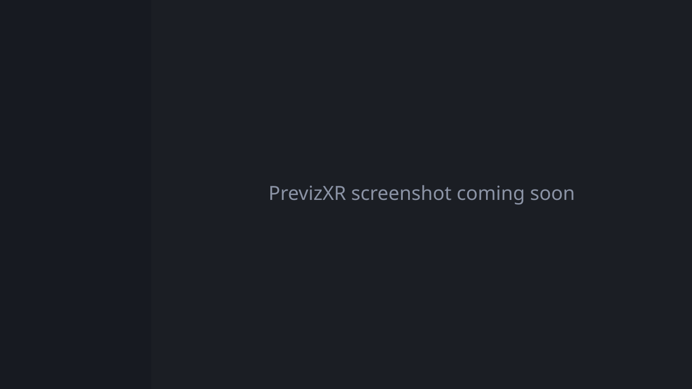

# PrevizXR

**Open-source VR previsualization for AI video.** Block out a scene in VR with actors, props and a handheld virtual camera, record camera takes, then export frame-synced video passes (clay, ID color, depth, normals, OpenPose skeletons) to drive generative video models with video-to-video, depth or pose control.

Runs entirely in the browser: Meta Quest 3 for capture, and desktop Chrome/Edge for scene building and rendering. No install, no server, no account.

**Live:** https://sirjoeyama.github.io/PrevizXR/


<!-- Screenshot placeholder: replace docs/screenshot.svg with a real capture -->

> **Status:** early development. Milestone 1 of 7 is done (app skeleton, desktop mode, Enter VR, Pages deploy). See the [roadmap](#roadmap).

## Features (planned)

- **Scene building:** humanoid actors with animation clips (idle, walk, run, sit) and waypoint paths; props (box, cylinder, chair, table, door, wall, car blockout); lights. Grab, move, rotate, scale, snap to floor, duplicate, undo and redo. Scenes save locally (IndexedDB) and import/export as JSON.
- **Virtual camera:** handheld camera with a live floating monitor; real focal lengths (14–135 mm) on Super35 or full-frame sensors; 16:9, 9:16, 2.39:1 and 1:1 aspect ratios; 24/25/30 fps; frame guides. Record takes with a countdown and play them back in the headset. Keyframed dolly/crane paths on desktop.
- **Export passes:** clay, color_id, depth, normals and OpenPose (COCO-18), all at the same resolution and frame rate, encoded to H.264 MP4 with WebCodecs (or a PNG-sequence zip as a fallback). Plus the camera as JSON and as an animated glTF, bundled into one zip with a `manifest.json`.

## Setup

Requires Node.js 22 or newer.

```bash
git clone https://github.com/SirJoeYama/PrevizXR.git
cd PrevizXR
npm install
npm run dev
```

Open http://localhost:5173.

| Command | What it does |
| --- | --- |
| `npm run dev` | Dev server with hot reload (also reachable on your LAN) |
| `npm run check` | Lint, typecheck and unit tests |
| `npm run build` | Production build into `dist/` |
| `npm run preview` | Serve the production build |

### Testing in VR

- **Quest 3:** WebXR needs HTTPS or localhost. With the headset connected over USB and developer mode on, run `adb reverse tcp:5173 tcp:5173`, then open `http://localhost:5173` in the Quest browser. Or open the live Pages URL.
- **No headset:** install the [Immersive Web Emulator](https://chromewebstore.google.com/detail/immersive-web-emulator/cgffilbpcibhmcfbgggfhfolhkfbhmik) extension for Chrome/Edge, open DevTools → WebXR, choose a Meta Quest 3 device, and reload. **Enter VR** becomes available.

## Controls

### Desktop

| Input | Action |
| --- | --- |
| Left drag | Orbit |
| Right drag | Pan |
| Mouse wheel | Zoom |
| `W` `A` `S` `D` / arrow keys | Move (click the viewport first) |
| `Q` / `E` | Down / up |
| `Shift` | Move faster |

### VR (Quest controllers)

| Input | Action |
| --- | --- |
| Enter VR button | Start an immersive session (the floor is at your real floor) |

More controls arrive with each milestone.

## Feeding passes into AI video tools

Every pass is rendered from the same camera, at the same resolution and frame rate, so the frames line up exactly. Typical uses:

| Pass | Use it as |
| --- | --- |
| `depth.mp4` | Depth control (ControlNet depth, Runway/Luma-style structure guidance, Wan/VACE depth conditioning). White means near. |
| `pose.mp4` | OpenPose control for character motion (ControlNet OpenPose, VACE pose, Animate-style pipelines). COCO-18 keypoints in standard OpenPose colors on black. |
| `clay.mp4` | Source video for video-to-video restyling (Runway Gen-4 V2V, Luma Modify, Kling, ComfyUI AnimateDiff/VACE). Neutral grey keeps the model free to invent materials. |
| `normals.mp4` | Normal-map control where supported, or as an extra structure cue. |
| `color_id.mp4` | Segmentation-style masks: each actor or prop has a flat, unique color, handy for regional prompts or compositing masks. |
| `camera.json` / `camera.glb` | The exact camera move, to match it in Blender, Unreal or After Effects, or to drive camera-conditioned models. |

Tips:
- Pick the aspect ratio and fps your target model supports *before* recording (for example 16:9 at 24 fps).
- Keep takes short, around 5–10 s; most models generate clips of that length.
- In ComfyUI, load each pass with a "Load Video" node and route it to the matching ControlNet or preprocessor-bypass input. The passes are already preprocessed.

## Roadmap

1. ✅ Vite + Three.js skeleton, desktop mode, Enter VR, Pages deploy
2. Spawning and manipulating actors and props in VR and desktop; save/load
3. Virtual camera with live monitor and lens controls
4. Take recording and playback
5. Render mode with clay, color_id and depth to MP4
6. Normals and pose passes, camera export, zip bundle
7. Polish: Quest performance (72 fps), docs, menu accessibility, hand tracking

## Contributing

See [CLAUDE.md](CLAUDE.md) for the architecture, folder layout and conventions. Assets must be CC0 and listed in [ASSETS.md](ASSETS.md).

## License

[MIT](LICENSE). Bundled assets are CC0; see [ASSETS.md](ASSETS.md).
